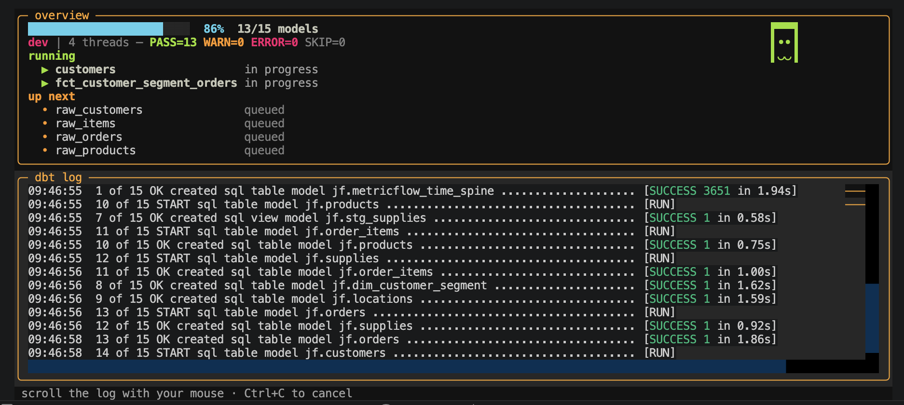

# dbt-baby-sugar

A plugin for dbt that sweetens its log: a live overview panel — progress bar,
pass/warn/error tally, what's running, what's up next, and an animated mascot
that reacts to how the run is going — sitting above a scrollable dbt log.

While dbt runs, `dbt-baby-sugar` takes over the screen with two panes: a fixed
**overview** at the top and a mouse-scrollable **dbt log** below. The overview
shows a stable `done/total` progress bar, the running tally, the nodes currently
executing, and the ones queued up next — so you can tell at a glance how far
along you are without squinting at a wall of log lines.

